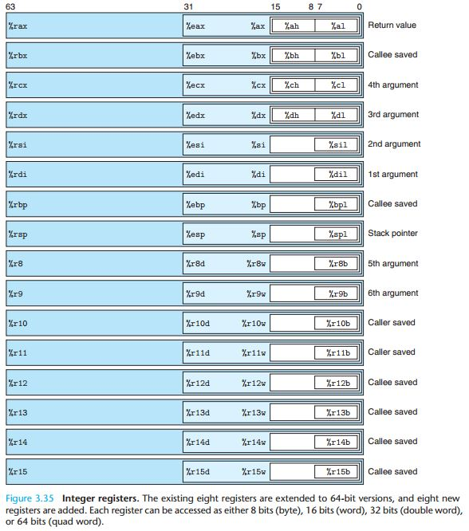

也许，在开始正式接触二进制漏洞之前，我们需要先看看汇编语言？

大部分现在市面上的教程对于汇编语言从来都不深究原理，只会告诉你最基础的用法，或者就干脆像同济版的《线性代数》一样，跟本说明书一样，对新手及其不友好，我们这里争取使用最简单的方法来讲解汇编语言，让大家能够快速上手。

## 开始吧

这里，我们从一个最简单的例子开始

入门pwn大伙基本都是从栈溢出开始的，而想要理解栈溢出的最基本原理，汇编和栈是必不可少的，我们这里以一个最简单的hello world程序为例子来介绍汇编语言和栈，这里我们用到的环境是Ubuntu 20，程序都是64位的，请先自行装好gcc

### Hello World

main.c

```cpp
#include<stdio.h>

int main(){
    printf("hello world");
    return 0;
}
```

相信这是一个大家都能看明白的程序，C语言的Hello World，那么接着我们会想用GCC等编译器将其编译为二进制文件，从而其就可以在计算机上运行了，而在这个编译过程中，就有一个中间步骤：将C语言源码转化为汇编语言<br>

首先对main.c做如下操作

`gcc -S main.c -o main.s -masm=intel`

现在，我们的c语言源码main.c会被编译，并输出等价的intel语法的汇编语言源码在main.s中

main.s（这里删除了一些用不到的代码，只保留了需要的

```asm
.LC0:
	.string	"hello world"
main:
	lea	rdi, .LC0[rip]
	mov	eax, 0
	call	printf@PLT
	mov	eax, 0
	ret
```

.LC0可以看做是一个常量，其内容是字符串的hello world，而下面的main: 就是main函数了<br>

现在我们来介绍现在这个main函数用到的几个指令<br>

首先是lea，其含义是计算有效地址，在这里，我们可以看做是将 .LC0[rip]的地址，即hello world字符串的地址转移至rdi寄存器中，好了又提到了一个新的名称：寄存器，这玩意是一个位于CPU内的储存结构，里边可以存一些变量啥的，而这里的rdi寄存器就是第一个参数的寄存器，这么说可能有点别捏。我们接下来是要调用printf函数的，这个在c语言源码中也能看出来，在C语言中，hello world字符串是printf的第一个参数，那么在汇编里，我们在调用printf函数之前，就需要为这一次函数调用准备好参数，而rdi寄存器用来传递第一个参数，所以，汇编语言这里就将hello world的地址复制到了rdi寄存器中 <br>

在解决好了参数以后，就直接调用了printf函数，即下面的 call printf 指令 <br>

在这个过程中，还有两个指令，mov eax, 0这个我们没有说，mov是move的缩写，这里的意思也就是将0复制（转移）到eax寄存器中，而eax这个寄存器也比较特殊，它是返回值寄存器，任何函数的返回值都会被储存在这个寄存器中，举个例子，在我们call printf以后，eax寄存器内的值就会变成printf的返回值，而我们main函数在返回的时候是有一个return 0的，所以在ret（return返回）指令前，有一条 mov eax, 0的指令，这样在return的时候才能保证我们的返回值是0，至于前面那个mov eax, 0其实没啥用<br>

好了讲完了这个最简单的程序，我们再把它复杂化一下，来详细介绍函数调用流程和栈<br>

add.c

```cpp
#include<stdio.h>

int add(int a, int b){
    return a + b;
} 

int main(){
    printf("%d", add(2, 3));
    return 0;
}
```

相信这个add程序应该也是大家入门函数调用的时候的经典，那么这个add程序变成汇编以后是什么样的呢？

add.s（还是省略了一些，但是又多了一点东西

```asm
add:
        push	rbp
	mov	rbp, rsp
	mov	DWORD PTR -4[rbp], edi
	mov	DWORD PTR -8[rbp], esi
	mov	edx, DWORD PTR -4[rbp]
	mov	eax, DWORD PTR -8[rbp]
	add	eax, edx
	pop	rbp
	ret
main:
	push	rbp
	mov	rbp, rsp
	mov	esi, 3
	mov	edi, 2
	call	add
	mov	esi, eax
	lea	rdi, .LC0[rip]
	mov	eax, 0
	call	printf@PLT
	mov	eax, 0
	pop	rbp
	ret
```

先看看add函数里都干了什么，前面的push rbp和move rbp rbp,rsp我们先不管 <br>

其将edi寄存器内的值通过mov指令复制到了 **DWORD PTR -4[rbp]** 这个地方，这个地方是啥暂时不管，并且将 **esi** 寄存器内的值复制到了 **DWORD PTR -8[rbp]** 这个地方，再然后，又将这两个地方的值转移回了edx寄存器和eax寄存器，嘶，那么 **edi** 和 **esi** 寄存器原本是什么东西？其实其是add函数第一个参数和第二个参数，那我们之前不是说 **rdi** 寄存器才是第一个参数吗？ **edi** 其实就是 **rdi** ，只不过他们的范围不太一样， **edi** 寄存器的范围为 **rdi** 寄存器的低32位，而 **rdi** 寄存器是64位的，同样的，还有 **di** 寄存器和 **dil** 寄存器，分别表示 **rdi** 寄存器的低16位与低8位，简单放张图，其表明了这些寄存器之间的关系，侧边也说明了他们的作用，比如说 **rdi** 就标着1st argument，表明这是第一个参数的寄存器<br>

下面是一张表，大概包含了各个寄存器



好了回到之前的话题上，在add函数中，由于两个参数都是int类型的，只占32位，所以使用了edi寄存器和esi寄存器，先将两个参数分别复制到了两个奇奇怪怪的地方，然后又将他们复制到了eax寄存器和edx寄存器中，那么假设我们调用这个函数的时候这两个参数分别是3和2，那么现在eax和edx寄存器内就是3和2了<br>

下一步，执行add eax, edx，这条指令用膝盖都能猜到是做加法的意思，而其具体含义是 eax = eax + edx，那么也就是说将edx寄存器内的值加到eax上，所以现在eax就是这个加法函数的结果了，正好其实eax寄存器，是返回值寄存器，所以下面就直接ret了（先不管pop指令）<br>

相对应add的，还有sub（减法），mul（乘法），divl（除法），sall（左移），salr（右移），neg（取补），not（取反）等基础计算指令，具体的用法大家就百度一下吧~ <br>

现在我们就需要了解栈这个概念了，对于每一个函数调用过程，都会有一个属于其的栈空间<br>

先简单地介绍一下栈，对于每一个程序，其启动的时候，内核会为其分配一段内存，称为栈，假设在这个add程序中，内核为其分配的栈空间为 0xff00 - 0x10000，那么在启动的时候，rsp寄存器就会被赋值为 0x10000，对，赋的值是栈的最高地址，事实上，rsp寄存器储存的总是当前栈顶的位置

回到程序上来，在main函数启动的时候，会执行push rbp指令，push rbp指令等价于下面两条指令

```asm
sub rsp, 8
mov QWORD PTR [rsp], rbp
```

首先由sub指令将栈顶向下移了8个字节，也就是对rsp减个8，然后将rbp寄存器内的值复制到 rsp所指的地址上，前面的QWORD PTR表明我们要复制8个字节，也就是说将rbp寄存器内的8个字节（64位）复制到了我们刚刚“开辟”出来的8字节在栈上的空间。对应QWORD（8字节）的有DWORD（4字节），WORD(2字节)，BYTE（1字节）<br>

之前说了，rsp总是指向栈顶的位置，假设在进入main函数的时候（main并不是真正的程序入口），rsp寄存器指向0xff80的位置，那么执行了push rbp以后，栈就变成了这个样子


所以，push的含义其实也就很明确了，就是将一个值给压到栈里面去，在main函数中，这一步push rbp的作用其实是将rbp寄存器的值临时储存到栈里面，这样我们就可以拿rbp寄存器去干别的事了，只需要在返回之前将rbp寄存器的值还回去就好了<br>

现在就可以解释之前add函数里那两个奇怪的地方了，其实就是栈，我们先将传进来的两个参数作为临时变量储存在了栈中<br>

来完整走一遍add函数的流程，首先，由 **push rbp** 将 **rbp** 原本的值保存在栈中，然后 **mov rbp, rsp** ，使用rbp寄存器来储存当前栈顶的位置，再将传入的两个参数保存到栈中， **-4[rbp]** 指的是rbp所指的地址减4后的地址，同理 **-8[rbp]** 就是rbp所指的地址减8后的地址，因为这两个参数都是int，都是4字节，所以对于每个参数就只需要给4个字节的栈空间即可，再然后，将这两个值复制到了edx和eax寄存器中，并完成加法，在返回前还需要 **pop rbp** ，pop和push是对应的，push是压栈，pop就是出栈， **pop rbp** 就是将rbp原本的值还给rbp寄存器，这样可以保证在这个函数调用的过程中原本的环境（即一些变量啥的）没有发生改变，最后再通过ret指令返回，返回到 **call add** 指令的下一条指令，对于调用add函数的main函数而言，它也拿到了它想要的add的结果，储存在eax寄存器中，他只需要从这个寄存器内拿结果就好了

### 逻辑控制

了解完上面的流程后，不知道大概会不会有一个疑问，ret是依靠什么记住返回地址在哪的？它怎么知道要返回到 **call add** 的下一条指令？

在这之前，我们需要了解一下JMP指令和CMP/TEST指令，先看CMP吧

**CMP**：CMP表示比较两个寄存器或者内存中的值，比较的结果会影响到标志寄存器

**标志位寄存器**：标志位寄存器是一个64位的寄存器，其内部有很多标志位，什么是标志位？？我们先把64位的寄存器看成64个个二进制位，然后，我们先考虑只用其中的3个位，其中第一位表示我今天吃了M记，第二位表示我今天打了胶，第三位表示我今天窜了，那么如果我今天什么都没干，就可以用 **000** 表示我今天的状态，而如果我今天只窜了，就可以用 **001** 表示我今天的状态，这样，我们就可以用这三个位来表示我今天的状态了，而这三个位就是标志位，而标志位寄存器就是用来储存这些标志位的，而CMP指令就是用来改变标志位的，比如说，如果两个值相等，那么ZF（零标志位）就会被置为1，如果两个值不相等，那么ZF就会被置为0，这个ZF就是一个标志位，用来标志两个值是否相等

**跳转**：有了标志位，我们就可以根据标志位来决定是否跳转了，比如说，我们可以这样写，如果是相等就跳转的话，我们可以这么写

```asm
je 0x12345678
```

`je` 表示 `JUMP IF EQUAL`，即相等就跳转，其等价于`JUMP IF ZF = 1`，即如果ZF标志位为1，就跳转到0x12345678这个地址，而这个地址就是我们要跳转到的地址，这个地址可以是一个函数的地址，也可以是一个标签的地址，比如说，我们可以这么写

之前说了，CMP指令可以比较两个数，那具体是怎么比较的呢？其实很简单啊。。

`CMP eax, ebx` 等价于 `SUB eax, ebx`，即 eax - ebx，但是不会将结果放回eax，并同时会影响标志位，如果说现在减完的结果为0，那么`ZF` 就会被置为1，如果不为0，那么`ZF` 就会被置为0

OK，那现在可以写一个简单的if语句了

```c
#include<stdio.h>

int main(){
    int a = 1;
    int b = 2;
    if(a == b){
        printf("a == b");
    }
    return 0;
}
```

可以编译为汇编语言

```asm
.LC0:
    .string	"a == b"
main:
    push	rbp
    mov	rbp, rsp
    mov	DWORD PTR -4[rbp], 1
    mov	DWORD PTR -8[rbp], 2
    mov	eax, DWORD PTR -4[rbp]
    cmp	eax, DWORD PTR -8[rbp]
    jne	.L2
    lea	rdi, .LC0[rip]
    mov	eax, 0
    call	printf@PLT
.L2:
    mov	eax, 0
    pop	rbp
    ret
```

可以看到，其实现的原理就是，先将a和b的值分别复制到eax和edx寄存器中，然后比较eax和edx寄存器中的值，如果相等就跳转到.L2这个标签所在的位置，如果不相等就继续往下执行

下面我们列出一张表，表中列出了一些常用的跳转指令

| 指令 | 含义 | 语法 |
| --- | --- | --- |
| JMP | 无条件跳转 | JMP 目标地址 |
| JE | 相等跳转 | JE 目标地址 |
| JNE | 不相等跳转 | JNE 目标地址 |
| JZ | 零标志位跳转 | JZ 目标地址 |
| JNZ | 非零标志位跳转 | JNZ 目标地址 |
| JA | 无符号大于跳转 | JA 目标地址 |
| JAE | 无符号大于等于跳转 | JAE 目标地址 |
| JB | 无符号小于跳转 | JB 目标地址 |
| JBE | 无符号小于等于跳转 | JBE 目标地址 |
| JG | 有符号大于跳转 | JG 目标地址 |
| JGE | 有符号大于等于跳转 | JGE 目标地址 |
| JL | 有符号小于跳转 | JL 目标地址 |
| JLE | 有符号小于等于跳转 | JLE 目标地址 |

### 循环

有了跳转，我们就可以实现循环了，比如说，我们想要实现一个循环，让程序一直输出hello world，那么我们可以这么写

```c
#include<stdio.h>

int main(){
    while(1){
        printf("hello world");
    }
    return 0;
}
```

编译为汇编语言

```asm
.LC0:
    .string	"hello world"
main:
    push	rbp
    mov	rbp, rsp
.L2:
    lea	rdi, .LC0[rip]
    mov	eax, 0
    call	printf@PLT
    jmp	.L2
    mov	eax, 0
    pop	rbp
    ret
```

可以看到啊，本质上就是JMP指令的使用，而像for循环，本质上就是CMP套JMP，仍然是一样

```c
#include<stdio.h>

int main(){
    for(int i = 0; i < 10; i++){
        printf("hello world");
    }
    return 0;
}
```

编译为汇编语言

```asm

.LC0:
    .string	"hello world"
main:
    push	rbp
    mov	rbp, rsp 
    mov	DWORD PTR -4[rbp], 0 // int i = 0
.L2:
    cmp	DWORD PTR -4[rbp], 9 // i < 10
    jg	.L3                  // 不满足条件就跳转到.L3，即跳出循环
    lea	rdi, .LC0[rip]
    mov	eax, 0
    call	printf@PLT
    add	DWORD PTR -4[rbp], 1 // i++
    jmp	.L2                  // 返回到for循环的开始
.L3:
    mov	eax, 0
    pop	rbp
    ret
```

最后，是TEST指令，其实和CMP指令差不多，只不过其是等价于 `AND` 指令，即 `TEST eax, ebx` 等价于 `AND eax, ebx`，其会将eax和ebx寄存器内的值进行与操作，并同时会影响标志位，如果说现在与完的结果为0，那么ZF（零标志位）就会被置为1，如果不为0，那么ZF就会被置为0

最后的最后，我们提一下标志位吧，实际上标志位是很多的，因为SUB ADD等操作是会产生溢出的，以及会有负数处理的情况，比如说 2222-3333=-1111，这是导致了正数被减为了负数，这种情况就会影响标志位，比如说，如果是正数减为了负数，那么SF（符号标志位）就会被置为1，如果是负数减为了正数，那么SF就会被置为0，而OF（溢出标志位）就会被置为1，如果没有溢出，那么OF就会被置为0，这里就不再一一列举了，大家可以自行百度一下

### 函数调用

在上面的例子中，我们已经见识到了函数调用的过程，但是返回具体是怎么返回的呢？我们其实只需要拆解call指令和ret指令即可，先看call

**call func**：
```asm
push rip
jmp func
```

rip寄存器是受到硬件控制，永远指向下一条指令的地址，所以，我们先将rip寄存器内的值压栈，然后跳转到func函数，这样，func函数就可以把要返回的地址储存在栈里

**ret**：
```asm
pop rip
```

将栈顶的值弹出到rip寄存器中，这样就可以返回到call指令的下一条指令了

现在你知道了，其实函数调用的过程就是将返回地址压栈，然后跳转到函数，然后函数执行完毕后，再将返回地址弹出到rip寄存器中，这样就可以返回到call指令的下一条指令